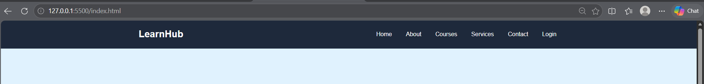
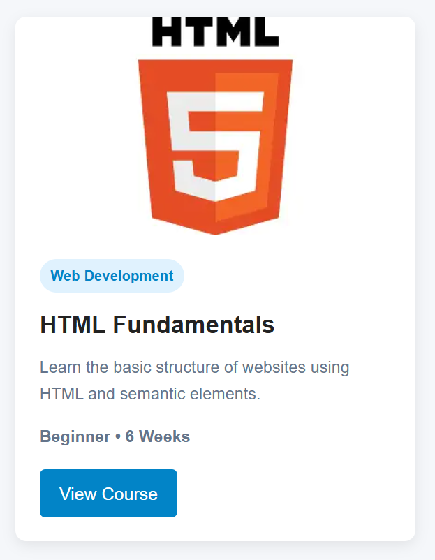
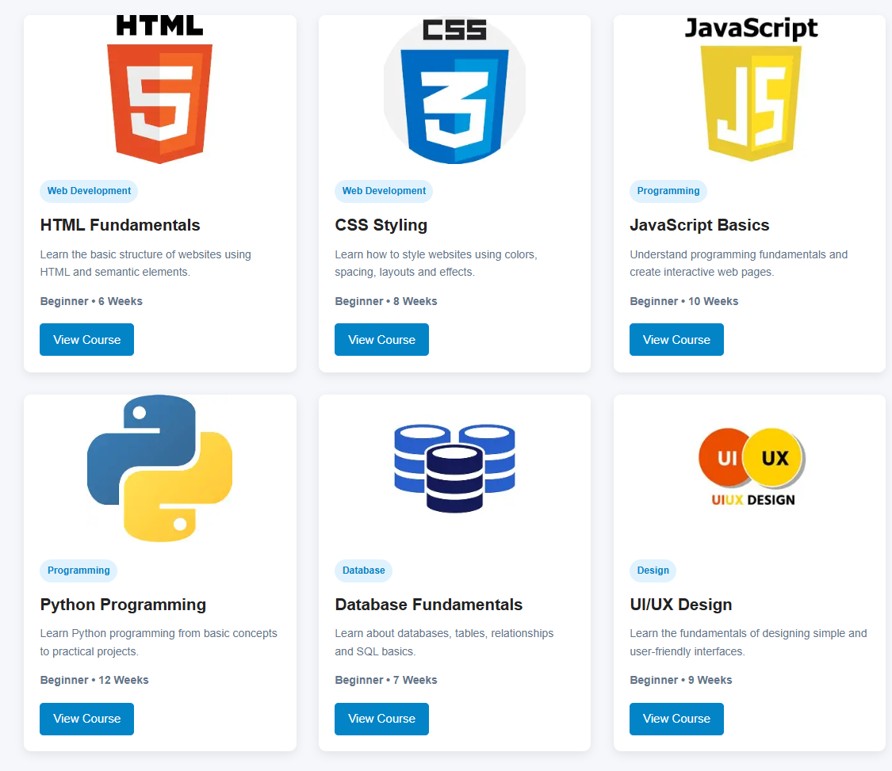
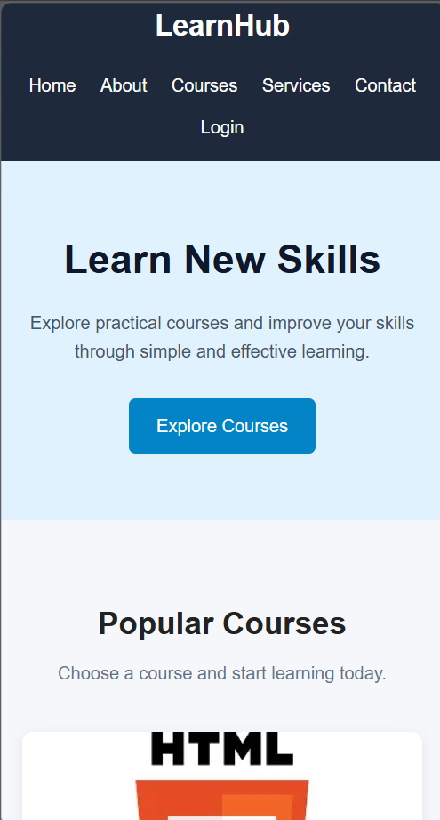

LearnSkill Website

Student Information
- Name: Pranil Maharjan
- Student ID: 2602412435
- Module: Fundamentals of Software Engineering
- Teacher: Ram Udgar Yadav

Project Description

LearnSkill is an educational website that provides information about different courses.
The website contains a navigation bar, introduction section, six course cards, and a footer. It is designed using HTML and CSS and is responsive for desktop, tablet, and mobile devices.

Technologies Used
- HTML5
- CSS3

Learning Resources

YouTube
I used YouTube tutorials to understand HTML and CSS concepts such as webpage structure, styling, cards, and responsive design.

ChatGPT
I used ChatGPT to understand HTML and CSS concepts, explain code, and troubleshoot problems during development.

Other Websites
I used other websites to understand HTML and CSS syntax and styling concepts.

What I Learned and How I Applied It

HTML
I learned how to create the structure of a webpage using HTML elements.
I applied this by creating the navigation bar, introduction section, six course cards, and footer.

CSS
I learned how to style webpages using CSS.
I applied CSS to add colors, spacing, typography, borders, shadows, buttons, and hover effects.

Flexbox
I learned how Flexbox can be used to arrange elements.
I applied Flexbox to the navigation bar and card content.

CSS Grid
I learned how CSS Grid can be used to create a card layout.
I used CSS Grid to display three cards per row on desktop, two on tablet, and one on mobile.

Responsive Design
I learned how media queries can change the layout depending on screen size.
I applied media queries to make the website responsive on different screen sizes.

Screenshots

Navigation Bar

Card Design

Card Layout

Responsive Design

Key Concepts Used
- Semantic HTML
- CSS selectors
- Colors
- Typography
- Margin and padding
- Box model
- Flexbox
- CSS Grid
- Borders and border radius
- Hover effects
- Responsive design
- Media queries
- Image handling

Challenges and Solutions

Challenge 1: Images were not fitting correctly
Some images did not fit properly inside the course cards.
Solution: I used the CSS `object-fit` property to control how the images fit inside the card image area.

Challenge 2: Making the cards responsive was difficult
It was difficult to make the cards display correctly on different screen sizes.
Solution: I used CSS Grid and media queries to display three cards on desktop, two on tablet, and one on mobile.

GitHub Repository
GitHub URL:(https://github.com/pranilmhrjn/Html-and-CSS-assignment.git)

AI Use Disclosure
I used ChatGPT as a learning and development support tool during this project.
I used it to understand HTML and CSS concepts, explain code, and troubleshoot problems. I reviewed and applied the code while developing the website.